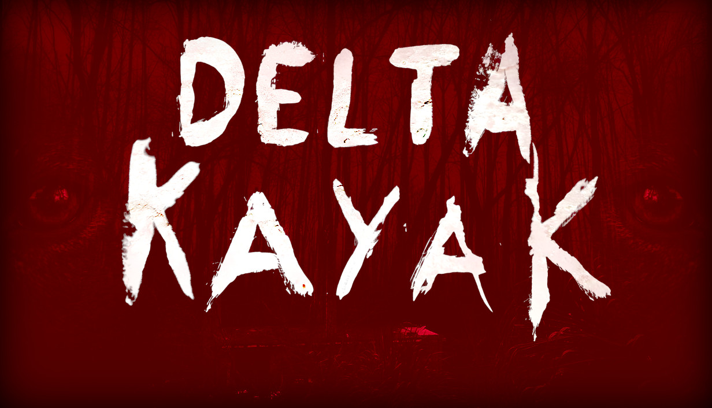

# Delta Kayak
Horror game, made in Godot 4

> Navigate an open-world island in your kayak, avoid the giant boat stalking you, and venture deep into the unknown to find your missing pet.

Wishlist on [Steam](https://store.steampowered.com/app/2632680/Delta_Kayak/) ❤️

### VR
The game has experimental VR support.
To enable it add the following argument when launching: `--xr-mode on -- --vr`

### Attributions
Note that not all items in the list are currently in use.

#### Fonts

- [Rosario Font](https://github.com/Omnibus-Type/Rosario) by Omnibus-Type
- [Shortcut](http://www.misprintedtype.com/) by misprintedtype

#### Godot Addons

 - [Godot Resource Groups](https://github.com/derkork/godot-resource-groups)

#### Sounds

- RIVER gurgling detailed.wav - nicoproson
- Kayak.mp3 - uniuniversal
- horror ambience 75 140328_143.ogg by klankbeeld -- https://freesound.org/s/237275/ -- License: Attribution 4.0
- horror ambience hell.wav by klankbeeld -- https://freesound.org/s/535963/ -- License: Attribution 4.0
- Risers - Horror Whooshes Tension Builder 1.mp3 by original_sound -- https://freesound.org/s/494981/ -- License: Attribution 3.0
- Bow tapping violin thru delay pedal  by ladystarlightnyc -- https://freesound.org/s/197860/ -- License: Attribution 3.0

#### 3D models

- "Dog" (https://skfb.ly/o9DQT) by victory_mirosya is licensed under Creative Commons Attribution (http://creativecommons.org/licenses/by/4.0/).
- "Kayak with Paddle" (https://skfb.ly/oGBWI) by nayangway is licensed under Creative Commons Attribution (http://creativecommons.org/licenses/by/4.0/).
- "Lowpoly PS1 Basemesh Male, Unwrapped, Segmented" (https://skfb.ly/6XVJQ) by BitHack is licensed under Creative Commons Attribution (http://creativecommons.org/licenses/by/4.0/).
- "Segmented lowpoly base female PS1 style" (https://skfb.ly/6XNRC) by BitHack is licensed under Creative Commons Attribution (http://creativecommons.org/licenses/by/4.0/).
- "Capybara PS1 style" (https://skfb.ly/oAWtu) by Kabuum is licensed under Creative Commons Attribution (http://creativecommons.org/licenses/by/4.0/).
- "Generator" (https://skfb.ly/oSKv6) by victorberdugo1 is licensed under Creative Commons Attribution (http://creativecommons.org/licenses/by/4.0/).